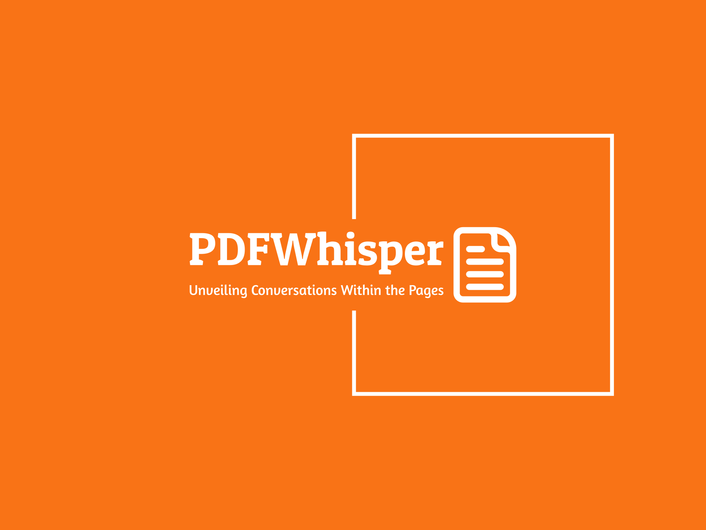

# PDFWhisper
<a href='https://pdf-whisper-puce.vercel.app/'>PDFWhisper - Unveiling Conversations Within the Pages </a>

This a AI based web application where user can chat with their pdf documents. User need only 3 steps to start chat with their pdf:
- Create an account
- Upload your pdf documents
- start chat or ask any question with in your pdf document

## Features
- Secure authentication using kinde authentication
- real time chat response
- Dynamic landing page
- Responsive UI
- Simple uploading process
- Admin dashboard for maintaining web application

## For making this web application I used-
- next js
- prisma
- mysql
- react
- tailwind
- shadcn
- open ai api
- pincone
- planetscale
- trpc (RPC APIs)
- uploadthing
- email js
- kinde authentication
- stripe
- pdf parse

<a href='https://pdf-whisper-puce.vercel.app/'>PDFWhisper - Unveiling Conversations Within the Pages </a>

 
© Pujon Das Auvi.

